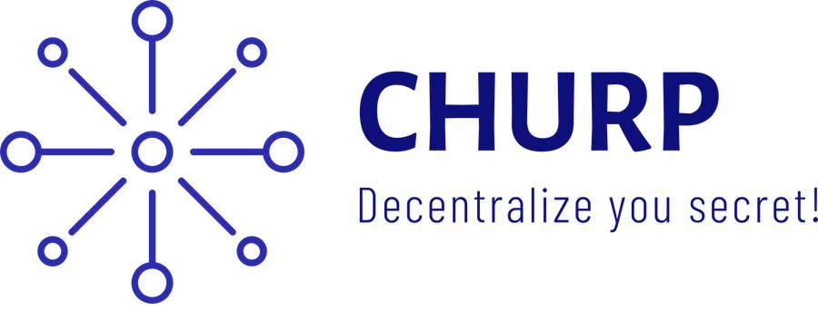

# CHURP: Dynamic-Committee Proactive Secret Sharing

Achieving decentralization requires decentralized cryptography. CHURP (CHUrn-Robust Proactive secret sharing) is a cryptographic protocol for secret sharing in decentralized settings, where committee nodes may come and go. In such a setting, traditional secret sharing (e.g., Shamir's) is no longer secure. Featuring several fundamental innovations, CHURP accomplishes the mission while being 2300x more efficient than previous schemes!

## Getting Started

This the repo for CHURP code (in Golang). Below you can find build and usage instructions.

If you want to run a demo or play with pre-complied CHURP, the easiest way to get started is to use docker. Please refer to the [docker document](https://docs.docker.com/install/#supported-platforms) for installation instructions.

If you want to build CHURP from source, we've prepared a special `builder` docker image for that, with dependecies installed. (If you really want to build/run the code natively, please refer to the [dockerfiles](dockerfiles/).)

### Run CHURP

We release compiled executables in the docker image `churp/churp`. For example, to run a demo of 5 nodes, you can use the script `simple.sh` which is part of the docker image:

~~~
docker run -ti churp/churp bash
# ./simple.sh 5 2
~~~

`simple.sh` starts a demo with n=5 nodes using a polynomial of degree t=2. **Note that we require n >= 2t+1**. 

### Build

We prepared a special `builder` docker image for building CHURP from source code. Make sure you're in the root of the repo (i.e., the directory that has `src`), then run the following to launch the builder:

~~~
docker run -ti -v $(pwd)/src:/src --workdir /src churp/builder bash
# make  # build using the provided Makefile
~~~

## API

At a high level, CHURP provides the following API:

* `initialize(t, [nodeList], ...)`: Set the required parameters for CHURP: `t` stands for the threshold and `nodeList` represents the set of nodes that form a committee. Some other parameters that need to be set are the epoch duration and commitment scheme parameters.

* (Optional) `storeSecret(SK)`: Distribute the secret `SK` using [(t, n)-sharing](https://en.wikipedia.org/wiki/Shamir%27s_Secret_Sharing) `(n=|nodeList|)` such that each node in `nodeList` stores a share of the secret. (Note that this function is optional. For some applications, the secret might be generated randomly using [Distributed Key Generation](https://en.wikipedia.org/wiki/Distributed_key_generation) protocols.)

* `changeCommittee([newNodeList])`: Execute CHURP to handoff the secret `SK` from the old committee, `nodeList`, to the new committee, `newNodeList`.

* (Optional) `retrieveSecret() -> SK`: Reconstruct the secret from shares retrieved from nodes in the `nodeList`. (Note that this function is optional, i.e., CHURP works without any need to explicitly reconstruct the secret.)

## Acknowledges

Currently CHURP is built on [Pairing Based Cryptography library](https://crypto.stanford.edu/pbc/) (LGPL) and its [Go wrapper](https://github.com/Nik-U/pbc), [GNU Multi Precision library](https://gmplib.org/) and its [Go wrapper](https://github.com/ncw/gmp) (BSD), and [Google Protobuffer](https://github.com/golang/protobuf).
